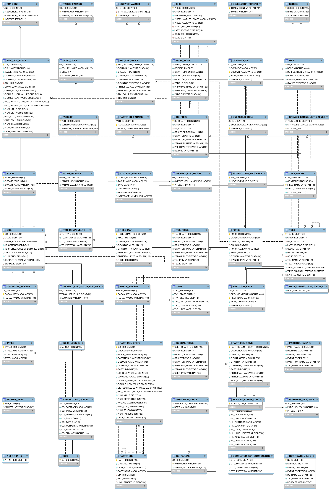

## hive-tools 项目介绍

在网易集团内部有大大小小几百套 hive 集群，为了满足网易猛犸大数据平台的元数据统一管理的需求，我们需要将多个分别独立的 hive 集群的元数据信息进行合并，但是不需要移动 HDFS 中的数据文件，比如可以将 hive2、hive3、hive4 的元数据全部合并到 hive1 的元数据 Mysql 中，然后就可以在 hive1 中处理 hive2、hive3、hive4 中的数据。

我们首先想到的是 hive 中有自带的 EXPORT 命令，可以把指定库表的数据和元数据导出到本地或者 HDFS 目录中，再通过 IMPORT 命令将元数据和数据文件导入新的 hive 仓库中，但是存在以下问题不符合我们的场景

1. 我们不需要重现导入数据；
2. 我们的每个 hive  中的表的数量多达上十万，分区数量几千万，无法指定 IMPORT 命令中的分区名；
3. 经过测试 IMPORT 命令执行效率也很低，在偶发性导入失败后，无法回滚已经导入的部分元数据，只能手工在 hive 中执行 drop table 操作，但是我们线上的 hive 配置是开启了删除表同时删除数据，这是无法接受的；

于是我们便考虑自己开发一个 hive 元数据迁移合并工具，满足我们的以下需求：

1. 可以将一个 hive 集群中的元数据全部迁移到目标 hive 集群中，不移动数据；
2. 在迁移失败的情况下，可以回退到元数据导入之前的状态；
3. 可以停止源 hive 服务，但不能停止目标 hive 的服务下，进行元数据迁移；
4. 迁移过程控制在十分钟之内，以减少对迁移方的业务影响；

## 元数据合并的难点

hive 的元数据信息（metastore）一般是通过 Mysql 数据库进行存储的，在 hive-1.2.1 版本中元数据信息有 54 张表进行了存储，比如存储了数据库名称的表 `DBS`、存储表名称的表 `TBLS` 、分区信息的 `PARTITIONS` 等等。

### 元数据表依赖关系非常复杂



元数据信息的这 54 张表通过 `ID` 号形成的很强的主外健依赖关系，例如

1. `DBS` 表中的  `DB_ID` 字段被 20 多张表作为外健进行了引用；
2. `TBLS` 表中的  `TBL_ID` 字段被 20 多张表作为外健进行了引用；
3. `TBLS` 表中的 `DB_ID` 字段是 `DBS` 表的外健、`SD_ID` 字段是 `SDS` 表的外健；
4. `PARTITIONS` 表中的 `TBL_ID` 字段是 `TBLS` 表的外健、`SD_ID` 字段是 `SDS` 表的外健；
5. `DATABASE_PARAMS` 表中的 `DB_ID` 字段是 `DBS` 表的外健；

这样的嵌套让表与表之间的关系表现为 [DBS]=>[TBLS]=>[PARTITIONS]=>[PARTITION_KEY_VALS]，像这样具有 5 层以上嵌套关系的有4-5 套，这为元数据合并带来了如下问题。

1. 源 hive 中的所有表的主键 ID 必须修改，否则会和目标 hive2 中的主键 ID 冲突，导致失败；
2. 源 hive 中所有表的主键 ID 修改后，但必须依然保持源 hive1 中自身的主外健依赖关系，也就是说所有的关联表的主外健 ID 都必须进行完全一致性的修改，比如 DBS 中的 ID 从 1 变成 100，那么 TBLS、PARTITIONS 等所有子表中的 DB_ID 也需要需要从 1 变成 100；
3. 按照表的依赖关系，我们必须首先导入主表，再导入子表，再导入子子表 …，否则也无法正确导入；

### 修改元数据的主外健 ID

我们使用了一个巧妙的方法来解决 ID 修改的问题：

1. 从目标 hive 中查询出所有表的最大 ID 号，将每个表的 ID 号加上源 hive 中所有对应表的 ID 号码，形成导入后新生成出的 ID 号，公式是：新表ID = 源表ID + 目标表 ID，因为所有的表都使用了相同的逻辑，通过这个方法我们的程序就不需要维护父子表之间主外健的 ID 号。
2. 唯一可能会存在问题的是，在线导入过程中，目标 hive 新创建了 DB，导致 DB_ID 冲突的问题，为此，我们在每次导入 hive 增加一个跳号，公式变为：新表ID = 源表ID + 目标表 ID + 跳号值（100）

### 数据库操作

我们使用了 mybatis 进行了源和目标这 2 个 Mysql  的数据库操作，从源 Mysql 中按照上面的逻辑关系取出元数据修改主外健的 ID 号再插入到目标 Mysql 数据库中。

1. 由于 mybatis 进行数据库操作的时候，需要通过表的 bean 对象进行操作，54 张表全部手工敲出来又累又容易出错，应该想办法偷懒，于是我们使用了 `druid` 解析 hive 的建表语句，再通过 `codemodel` 自动生成出了对应每个表的 54 个 JAVA 类对象。参见代码：`com.netease.hivetools.apps.SchemaToMetaBean`

   

### 元数据迁移操作步骤

1. 第一步：备份元数据迁移前的目标和源数据库

2. 第二步：将源数据库的元数据导入到临时数据库 exchange_db 中，需要一个临时数据库是因为源数据库的 hive 集群仍然在提供在线服务，元数据表的 ID 流水号仍然在变化，hive-tools 工具只支持目的数据库是在线状态；

3. 通过临时数据库 exchange_db 能够删除多余 hive db 的目的，还能够通过固定的数据库名称，规范整个元数据迁移操作流程，减低因为手工修改执行命令参数导致出错的概率

4. 在 hive-tools.properties 文件中中配置源和目的数据库的 JDBC 配置项

   ```shell
   # exchange_db
   exchange_db.jdbc.driverClassName=com.mysql.jdbc.Driver
   exchange_db.jdbc.url=jdbc:mysql://10.172.121.126:3306/hivecluster1?useUnicode=true&characterEncoding=utf8&autoReconnect=true&allowMultiQueries=true
   exchange_db.jdbc.username=src_hive
   exchange_db.jdbc.password=abcdefg
   
   # dest_hive
   dest_hive.jdbc.driverClassName=com.mysql.jdbc.Driver
   dest_hive.jdbc.url=jdbc:mysql://10.172.121.126:3306/hivecluster1?useUnicode=true&characterEncoding=utf8&autoReconnect=true&allowMultiQueries=true
   dest_hive.jdbc.username=dest_hive
   dest_hive.jdbc.password=abcdefg
   ```

5. 执行元数据迁移命令

   ```shell
   export SOURCE_NAME=exchange_db
   export DEST_NAME=dest_hive
   
   /home/hadoop/java-current/jre/bin/java -cp "./hive-tools-current.jar" com.netease.hivetools.apps.MetaDataMerge --s=$SOURCE_NAME --d=$DEST_NAME
   ```

6. hive-tools 会在迁移元数据之前首先检查源和目的元数据库中重名的 hive db，终止元数据迁移操作并给出提示

7. 执行删除重名数据库命令

   ```shell
   # 修改脚本中的 DEL_DB（多个库之间用逗号分割,default必须删除）参数和 DEL_TBL（为空则删除所有表）
   export SOURCE=exchange_db
   export DEL_DB=default,nisp_nhids,real,azkaban_autotest_db
   export DEL_TBL=
   
   ~/java-current/jre/bin/java -cp "./hive-tools-current.jar" com.netease.hivetools.apps.DelMetaData --s=$SOURCE --d=$DEL_DB --t=$DEL_TBL
   ```

8. 再次执行执行元数据迁移命令

9. 检查元数据迁移命令窗口日志或文件日志，如果发现元数据合并出错，通过对目的数据库进行执行删除指定 hive db 的命令，将迁移过去的元数据进行删除，如果没有错误，通过 hive 客户端检查目的数据库中是否能够正常使用新迁移过来的元数据

10. 严格按照我们的元数据迁移流程已经在网易集团内部通过 hive-tools 已经成功迁移合并了大量的 hive 元数据库，几乎没有出现过问题

## compile

mvn clean compile package -Dmaven.test.skip=true


## history


Release Notes - Hive-tools - Version 0.1.4

 * [hive-tools-0.1.5]
   MetaDataMerge add update SEQUENCE_TABLE NO

 * [hive-tools-0.1.4]
   MetastoreChangelog -z=zkHost -c=changelog -d=database -t=table
   thrift -gen java src/main/thrift/MetastoreUpdater.thrift

 * [hive-tools-0.1.3]
    - delete database metedata database_name/table_name support % wildcard

 * [hive-tools-0.1.2]
    - hdfs proxy user test

 * [hive-tools-0.1.1]
    - delete database metedata

 * [hive-tools-0.1.0]
    - hive meta schema convert to java bean
    - multiple hive meta merge